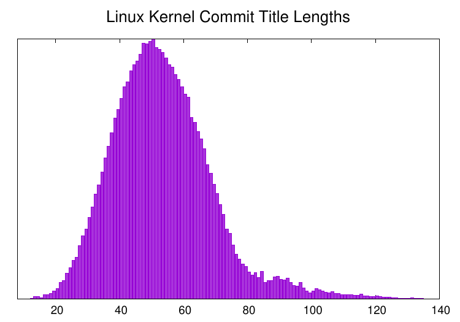
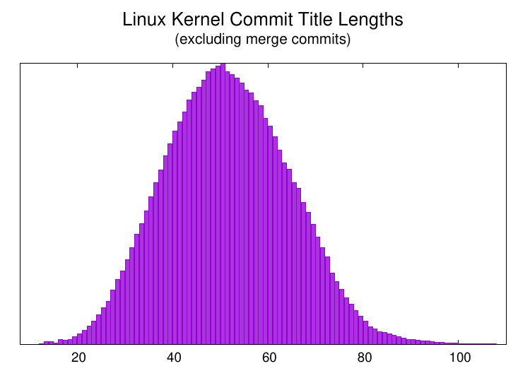

# Commit Title Lengths in the Linux Kernel Git Tree

Just a fun oneliner to plot a histogram of the distribution of commit title
lenghts in the Linux kernel Git tree. Can serve as an educational tool for
proper commit formatting :wink:. (More on proper commit formatting [here](https://chris.beams.io/posts/git-commit).)

## These examples are correct as of Linux 5.4:

### All the commits:

### Without merge commits:

Since merge commits introduce some noise, and their length is not really
telling much, here is a histogram with the merge commits removed:

## Credits:

Based on an idea from [here](https://stackoverflow.com/questions/2290016/git-commit-messages-50-72-formatting).
